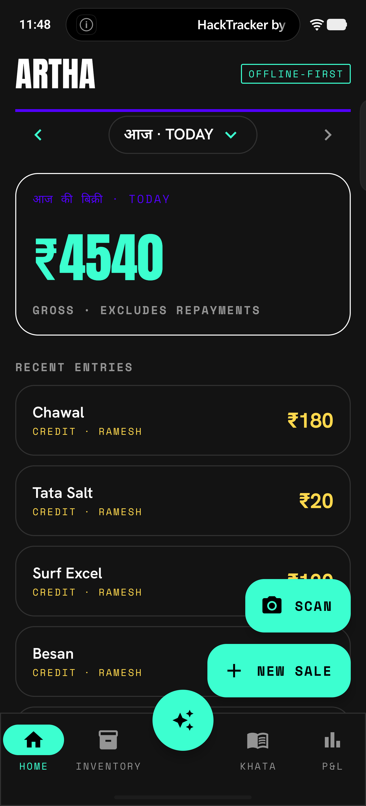
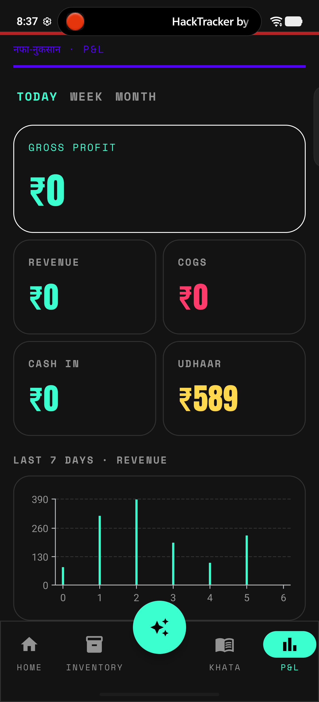
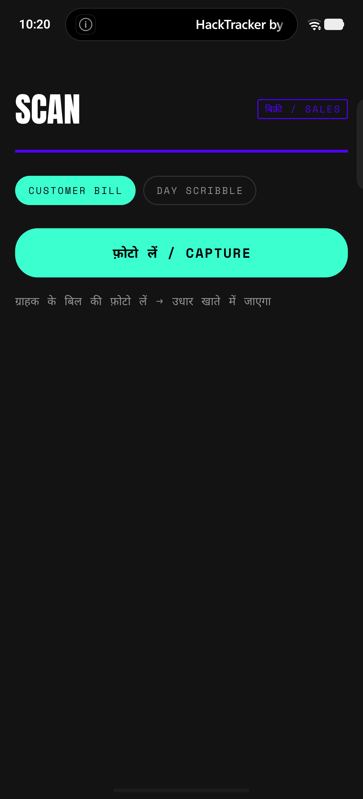
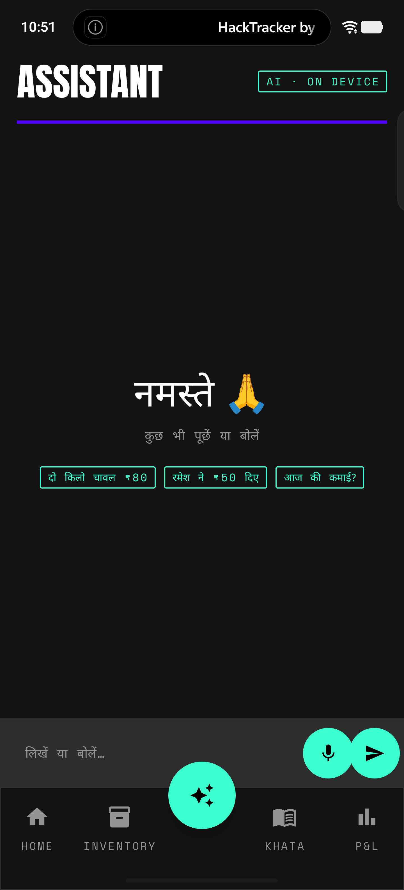
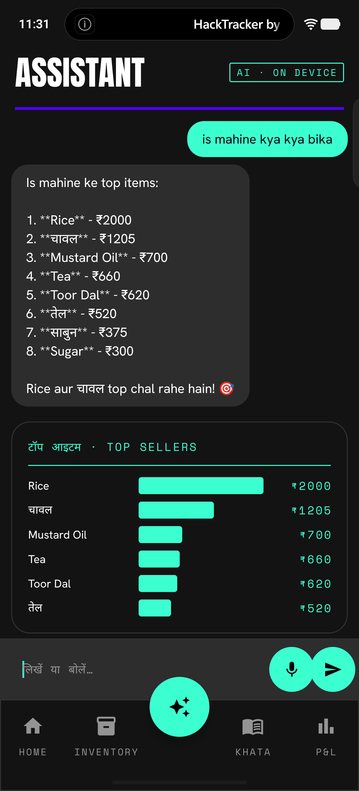

# Artha

**Turning the kirana counter into a financial identity for the next 500 million.**

> An AI commerce-and-finance OS for India's corner shops, where the phone is the only tool.
> Built for **PS 3 — Reimagine Money for Bharat** (iQOO Hackathon).

Artha hits three angles this problem statement names — **phone-as-POS, credit-scoring for the unbanked, and a vernacular assistant** — fused into one loop.

📊 **Pitch deck:** [`docs/Artha-Pitch.pptx`](docs/Artha-Pitch.pptx)

## Screenshots

<table>
  <tr>
    <td align="center" width="33%"><br><sub><b>Home + date navigator</b><br>any day's P&L · ◄ date ►</sub></td>
    <td align="center" width="33%"><br><sub><b>P&amp;L dashboard</b><br>revenue · profit · udhaar · chart</sub></td>
    <td align="center" width="33%"><br><sub><b>Scan a sale</b><br>customer bill / day scribble</sub></td>
  </tr>
  <tr>
    <td align="center"><br><sub><b>Scan a challan</b><br>supplier bill → priced stock</sub></td>
    <td align="center"><br><sub><b>Ask in Hindi</b><br>voice or text, your language</sub></td>
    <td align="center"><br><sub><b>Agent + charts</b><br>reads live data, answers visually</sub></td>
  </tr>
</table>

---

## Problem

India runs on **13 million kirana stores** — but they run on paper. The day's sales, the udhaar owed, the stock running low all live in a notebook under the counter. That paper is invisible to the financial system: a shopkeeper can't see her own profit or cash flow, and a 20-year track record earns her **zero formal credit**. Quick-commerce has shut **200,000 kiranas since 2023**.

Artha is an AI commerce-and-finance OS for the kirana where the phone is the only tool. She **photographs** her handwritten ledger, a customer's bill, or a wholesaler challan — vision AI reads the Hindi into a live P&L, inventory (with cost→sell margins), and udhaar tracker. She can **speak** an entry or **just ask, in her own language** — an agentic assistant reads her live shop data and answers with numbers *and* charts: what's selling, who owes the most, which item is bleeding her margin, what to reorder. **One tap** puts her stock online as a storefront — her answer to quick commerce. And every rupee she records builds the asset she's never had: a **credit profile**, underwritten on the commerce data she generates just by running her shop.

Not just digitising ledgers: giving 13 million shopkeepers a **financial identity**, and the first credit they were ever offered.

---

## Solution — a five-step loop, all on the phone

**capture → understand → advise → sell → credit.** Each step removes a friction that killed earlier ledger apps, and each feeds the next.

### 1. Capture (zero typing)
She photographs a page of her bahi-khata, a customer's bill, or a wholesaler challan — or just speaks the entry. **Claude Opus 4.8 vision** reads Hindi/Hinglish handwriting; a fine-tuned **whisper.cpp** Hindi model handles voice on-device. Capture is *mode-aware*: a daily-sales scribble becomes ledger entries, a customer bill posts straight to that customer's **udhaar**, and a supplier challan becomes **priced stock** — each shown as an editable review card before anything saves.

### 2. Understand
Entries become a structured **SQLite/Room** ledger that auto-builds a daily **P&L** (sales, COGS, net, cash vs udhaar), an **inventory** catalogue (stock, cost→sell margin, low-stock alerts), and an **udhaar tracker** (who owes what, per customer). Every sale line **snapshots its price and cost**, so margins stay accurate even when catalogue prices drift — credit-grade data, not approximations. A challan upserts products, sets cost + sell price, and logs the purchase into the P&L in one shot. Any past day is browsable via a date bar (◄ date ►) or a calendar.

### 3. Advise
This is where Artha stops being a ledger. A **fleet of AI agents** — Demand, Margin, Competition, Strategy — runs in parallel for a tight daily brief: what to restock, what's bleeding margin, what competitors are doing, the single highest-leverage move. On top sits a **conversational agentic assistant**: she asks anything in her own language — *"is mahine kya bika?"*, *"sabse zyada udhaar kiska?"*, *"kya reorder karun?"* — and a **tool-calling model queries her live shop data** and answers in Hinglish **with inline charts** (top-seller bars, P&L cards, who-owes lists) right in the chat. It can also turn a spoken sentence into a sale or a repayment, shown as a confirm card. Voice in; TTS reads the answer back.

### 4. Sell
One tap — **"Go online"** — publishes her live inventory as a neighbourhood storefront (delivery / pick-on-arrival). Orders land on an owner page she opens inside the app. Built from data she already has, it's her counter-punch to quick commerce.

### 5. Credit
Every recorded rupee feeds an **Artha Score (0–100)** + an indicative working-capital band — an **alternative-data credit profile** from real commerce flow (sales consistency, margin, cost control, udhaar recovery), the asset a bank could never see on paper. Live today as a loan-readiness score; NBFC-partnered origination is the roadmap and the business model.

### Why it holds where others broke
The ledger is **free** — it's acquisition and data, never the revenue. The storefront creates **daily habit** and a digital order trail. The credit layer is the **monetisation** the category never had. Each loop fixes the previous one's fatal flaw, and the compounding commerce data + lending relationship is the moat.

---

## Architecture

Phone-first, on a physical iQOO 15.

- **Multi-provider, cloud-first LLM** via OpenRouter — Claude **Haiku 4.5** for agents/parsing, **Opus 4.8** for vision — with an **on-device llama.cpp (Qwen 3B) fallback** so the loop never stops when signal drops.
- **On-device Hindi STT** — fine-tuned `whisper-hindi-small` (whisper.cpp, vendored, arm64).
- **Local data** — Room/SQLite v3 with customers, price snapshots, and reactive flows.
- **Tool-calling agent** — read-only shop-data tools (P&L, top-sellers, per-customer, day-trend, margins, low-stock, who-owes, inventory) + draft-action tools that surface confirm cards.
- **UI** — Kotlin + Jetpack Compose, Clean Architecture (`data` / `domain` / `ui`), Hilt, "The Verge"–inspired design system (canvas-black + mint/ultraviolet, Anton / Hanken Grotesk / Space Mono).
- Phone is the only interface; **OfficeKit bridges the agentic build.**

## Tech stack

Kotlin · Jetpack Compose · Material 3 · Hilt · Room · Ktor + kotlinx.serialization · whisper.cpp (JNI) · Vico · OpenRouter → Anthropic Claude · llama.cpp (Qwen 2.5 3B).

## Run it

```bash
adb devices                      # iQOO 15 = 10BFBG0CEL001DB
# Cloud is primary — put your OpenRouter key in keys.properties (gitignored) at repo root:
#   OPENROUTER_KEY=sk-or-...
#   OPENROUTER_MODEL=anthropic/claude-haiku-4.5
#   OPENROUTER_VISION_MODEL=anthropic/claude-opus-4.8
# (Optional offline fallback) start the on-device model:
./scripts/start-llama-server.sh  # Qwen 2.5 3B on the phone (127.0.0.1:8080)
./gradlew :app:installDebug      # JDK 17, AGP 8.13 (pinned)
adb shell am start -n com.artha.kirana/.MainActivity
```

More: [`HANDOFF.md`](HANDOFF.md) · [`docs/STATUS.md`](docs/STATUS.md) · [`CLAUDE.md`](CLAUDE.md).

---

*Toolchain is pinned (AGP 8.13 / Gradle 8.13 / JDK 17). The OpenRouter key lives only in the gitignored `keys.properties` — never commit it.*
